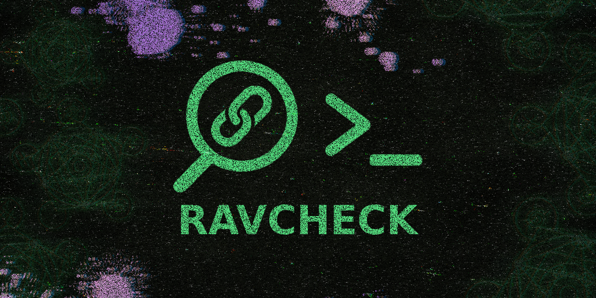

> [!WARNING]  
> Esta ferramenta está em fase **BETA** e passará por diversas melhorias ao longo do tempo... Caso identifique alguma falha durante o uso, recomendamos aguardar pelas próximas atualizações, que trarão melhorias e correções...


---

<div align="center">

<a href="https://www.npmjs.com/package/ravcheck" target="_blank"></a>  
 <a href="https://www.npmjs.com/package/ravcheck" target="_blank"></a>
</div>

---

<div align="center">

## 🚀 RAVCHECK

### ⚙️ CLI/NPM para envio automatizado de URLs para urlscan.io via API.

[](https://www.npmjs.com/package/ravcheck)
[](https://nodejs.org)
[](LICENSE)

*Ferramenta de segurança para análise automatizada de URLs*

</div>



---

</div>

## 📞 Suporte 

Se precisar de ajuda ou quiser falar com a equipe, entre no nosso servidor de suporte:

[](https://discord.gg/FncVNprdgP)

---

## 📋 Visão Geral

O **RAVCHECK** é uma ferramenta de linha de comando (CLI/NPM) que envia URLs automaticamente para análise por meio da API do [urlscan.io](https://urlscan.io). Destina-se a desenvolvedores, especialistas em segurança e profissionais que buscam automatizar esse processo.

## ⚠️ Pré-requisitos

- **Chave API do urlscan.io**: [Obtenha uma conta gratuita](https://urlscan.io/user/signup)
- **Node.js 14+**: Requerido para execução

<details>
<summary>📥 Como instalar o NodeJS?</summary>

- [COMO INSTALAR NODE JS NO WINDOWS?](https://youtu.be/-jft_9PlffQ)

</details>

## 📦 Instalação Rápida

```bash
# Instalar globalmente (recomendado)
npm i -g ravcheck
# ou
npm install -g ravcheck
```

### 🗑️ Desinstalar

```bash
npm uninstall -g ravcheck
# ou
npm remove -g ravcheck
```

## 🚀 Primeiros Passos

### 1. Configuração Inicial

Execute o comando para iniciar a configuração:

```bash
ravcheck
```

### 2. Configure sua Chave API

No menu principal:
1. Selecione **🔑 Configurar chave API**
2. Insira sua chave API do urlscan.io (formato UUID)
3. A chave será criptografada e armazenada com segurança

### 3. Adicione URLs para Análise

Edite o arquivo `options/links.txt`:

```txt
# Adicione suas URLs aqui, uma por linha
https://exemplo.com
https://teste.com
https://outro-site.com
```

## 💻 Como Usar

### 🎮 Modo Interativo (Recomendado)

```bash
ravcheck
```

*Menu completo com todas as funcionalidades organizadas*

### 📁 Estrutura de Pastas

Após a primeira execução, será criada a seguinte estrutura:

```
ravcheck/
├── auth/          # Chave API criptografada
├── options/       # Configurações do usuário
│   ├── links.txt          # URLs para análise
│   ├── tags.txt           # Tags personalizadas
│   ├── scan-visibility.txt # Visibilidade (public/unlisted/private)
│   ├── user-agent.txt     # Tipo de User-Agent
│   └── custom-user-agent.txt # User-Agent personalizado
└── logs/          # Logs organizados por categoria
    ├── erros/     # Logs de erros
    ├── sucesso/   # Logs de sucesso
    ├── csv/       # Exportações CSV
    ├── json/      # Exportações JSON
    ├── tmp/       # Arquivos temporários
    ├── debug/     # Logs de debug
    └── relatorios/ # Relatórios detalhados
```

## 🎯 Funcionalidades

### 🔗 Análise de URLs em Lote
- Processamento automático de múltiplas URLs
- Configuração via arquivo `links.txt`
- Delay configurável entre requisições

### 🏷️ Sistema de Tags Avançado
- Tags fixas (não editáveis) em `lib/config/fixedtags.txt`
- Tags personalizadas em `options/tags.txt`
- Combinação automática de tags fixas e personalizadas

### 🔒 Configurações de Visibilidade
- **Public**: Scan visível publicamente
- **Unlisted**: Apenas com link direto
- **Private**: Apenas para sua conta

### 🤖 User-Agent Configurável
- Padrão: User-Agent de RAVCHECK
- Navegadores: Chrome, Firefox, Safari
- Personalizado: Defina seu próprio User-Agent

### 📊 Monitoramento de Rate Limit
- Verificação automática de quotas
- Exibição de uso atual
- Avisos quando próximo do limite
- Próximos resets calculados automaticamente

### 📁 Sistema de Logs Organizado
- Logs separados por categoria
- Exportação em CSV e JSON
- Histórico de análises
- Debug detalhado disponível

## ⚙️ Menu Principal

Ao executar `ravcheck`, você terá acesso a:

```
🎯 MENU PRINCIPAL
────────────────────────────────────
🔗 Analisar URLs do arquivo links.txt
🔍 Analisar URL específica
⚙️ Configurações (public | default)
🏷️ Ver/Editar tags
📝 Ver/Editar URLs
🔑 Configurar chave API
📊 Rate Limit
📁 Logs
🧹 Limpar e Sair
❌ Sair
```

## 🔧 Configurações Avançadas

### Scan Visibility
Edite `options/scan-visibility.txt`:
```txt
public    # ou unlisted, private
```

### User Agent
Edite `options/user-agent.txt`:
```txt
default   # ou chrome, firefox, safari, custom
```

### Custom User Agent
Edite `options/custom-user-agent.txt`:
```txt
Mozilla/5.0 (Meu Scanner Personalizado)
```

## 📈 Exemplo de Uso

### 1. Preparação
```bash
# Instalar
npm install -g ravcheck

# Executar
ravcheck
```

### 2. Configurar API
```
🔑 CONFIGURAÇÃO DA API
────────────────────────
1. Selecione "Configurar chave API"
2. Insira sua chave: 12345678-1234-1234-1234-123456789012
3. Chave será salva criptografada
```

### 3. Adicionar URLs
Edite `options/links.txt`:
```txt
https://exemplo-1.com
https://exemplo-2.com
https://exemplo-3.com
```

### 4. Executar Análise
```
📊 RESUMO DA ANÁLISE
────────────────────
Total de URLs: 3
Tags: ravcheck, minha-tag
Visibilidade: public
Delay: 5 segundos
```

### 🔍 Modo Debug
```bash
# Ver logs detalhados
cat logs/debug/*.log

# Ver erros recentes
cat logs/erros/*.json
```

## 🔧 Dependências Principais

- `node-fetch` - Requisições HTTP
- `inquirer` - Interface interativa
- `crypto-js` - Criptografia da chave API
- `boxen` - Boxes estilizados
- `chalk` - Cores no terminal
- `figlet` - Banner ASCII

## 🏗️ Estrutura do Código

```
ravcheck/ 🌟
├── 📁 bin/                        # Ponto de entrada
│   └── 🚀 cli.js                  # Executável principal
├── 📁 lib/                        # Código fonte
│   ├── 📁 config/                 # Configurações
│   │   ├── 🎨 colors.js           # Sistema de cores
│   │   ├── 🏷️ fixedtags.txt       # Tags fixas
│   │   └── ⚙️ optionsManager.js   # Gerenciador de opções
│   ├── 📁 utils/                  # Utilitários
│   │   ├── 📦 box.js              # Boxes visuais
│   │   ├── 📝 logger.js           # Sistema de logging
│   │   ├── 📁 logManager.js       # Gerenciador de logs
│   │   └── 📦 packageInfo.js      # Informações do pacote
│   ├── 🏠 index.js                # Classe principal
│   └── 🎨 ui.js                   # Interface do usuário
├── 📁 data/                       # Dados estáticos
│   └── ⚡ rate-limit-free.js      # Configurações de rate limit
├── 📁 auth/                       # Autenticação
│   └── 🔐 index.js                # Gerenciador de autenticação
├── 📁 options/                    # Configurações do usuário
│   ├── 🔗 links.txt               # URLs para análise
│   ├── 🏷️ tags.txt                # Tags personalizadas
│   ├── 🔒 scan-visibility.txt     # Visibilidade
│   ├── 🤖 user-agent.txt          # Tipo de User-Agent
│   └── ⚡ custom-user-agent.txt   # User-Agent personalizado
├── 📄 package.json                # Configuração do NPM
└── 📖 README.md                   # Esta documentação
```

## 📄 Licença

Este projeto está sob a licença MIT. Veja o arquivo [LICENSE](LICENSE) para detalhes.

---

## Star History

<a href="https://www.star-history.com/#ravenastar-js/ravcheck&Date">
 <picture>
   <source media="(prefers-color-scheme: dark)" srcset="https://api.star-history.com/svg?repos=ravenastar-js/ravcheck&type=Date&theme=dark" />
   <source media="(prefers-color-scheme: light)" srcset="https://api.star-history.com/svg?repos=ravenastar-js/ravcheck&type=Date" />
   
 </picture>
</a>

---

<div align="center">

## Feito com 💚 por [RavenaStar](https://linktr.ee/ravenastar)

[⬆ Voltar ao topo](#-rav-archive)

</div>